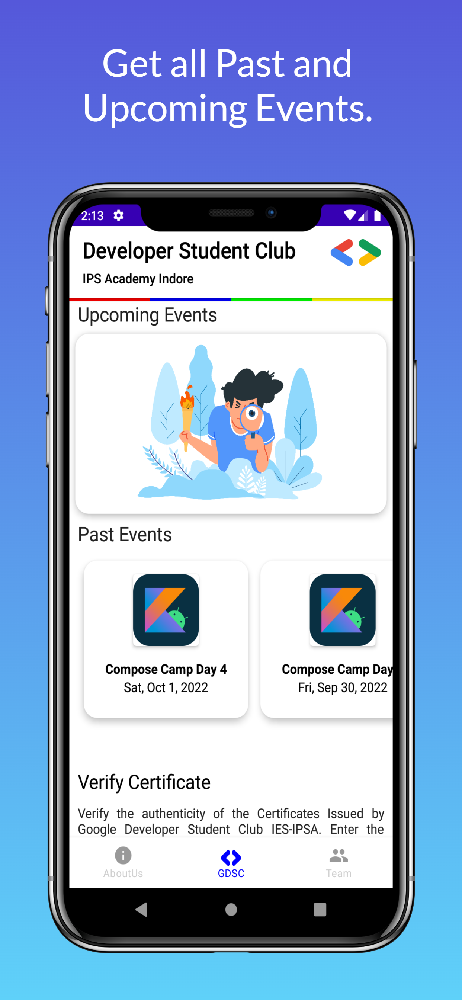
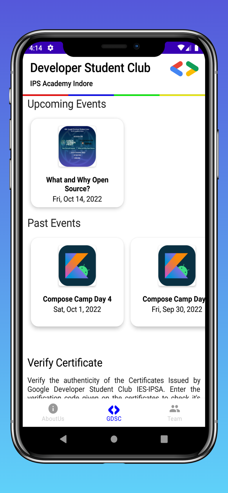
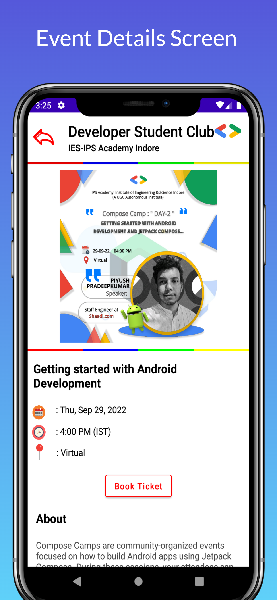
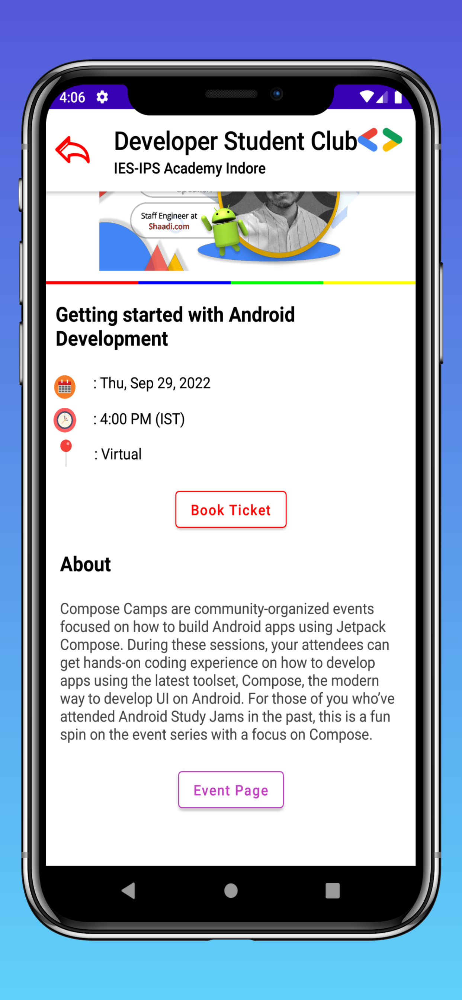
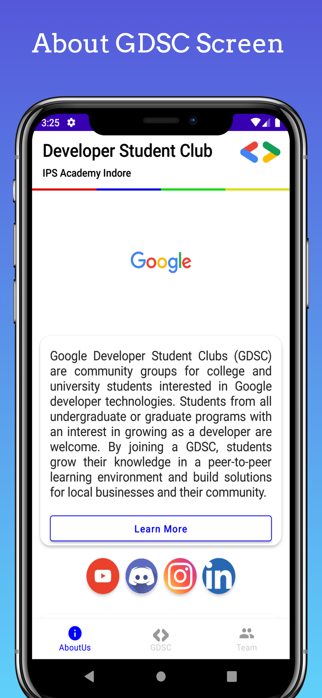
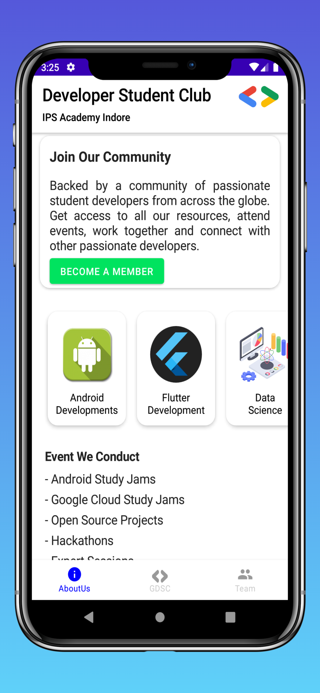
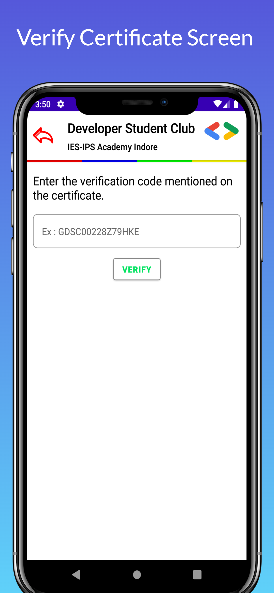
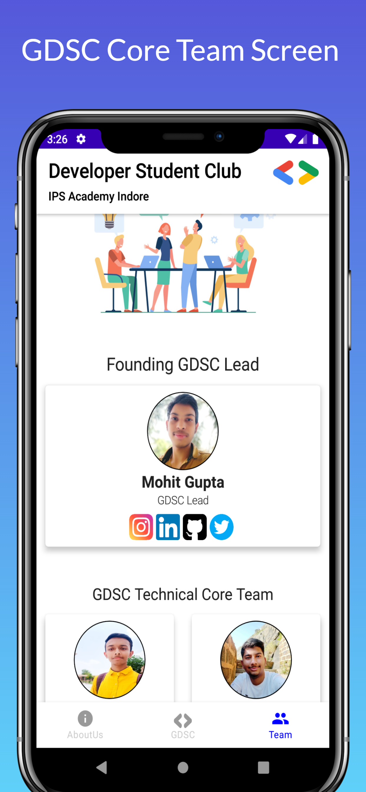

# Compose Camp (ANDROID STUDY JAMS)

Community App of Google Developer Student Club @ IPS Acacdemy

# Application Install

***You can Install and test latest GDSC IPS Academy app from below 👇***

<b> Problem Statement: </b>

Getting Information and all the resource related to Google Developer Student Club IPS Academy and all the Events, Hackathons, etc. that we conduct gets complicated as Information and resources are divided on multiple platforms such as the DSC Community Website, WhatsApp Group of GDSC IPSA, Discord Server of GDSC IPSA, GitHub Org of GDSC IPSA, YouTube channel of GDSC IPSA and so on. Specific Technologies can be used to Implement a solution to ease the process and concentrate all the Information related to GDSC IPSA on a single platform.

<b> Proposed Solution : </b>

This project proposes a "Community Android Application" to accumulate all the Information and Resources related to our developer community here at GDSC IPSA in one single Android Application, which will make it a one-stop destination for all community members to access all the resources from one single platform rather than searching over all our social media handles and web-pages.

## 📸 Screenshots

|||||
|:----------------------------------------:|:-----------------------------------------:|:-----------------------------------------: |:-----------------------------------------: |
|  |  |  |  |
|  |  |  |  |

## Technology Stack Used :

    	  	
# <b> Functionality & Concepts used : </b>

## Functionalities in the app :

- Find all our Social Media handles and Developer Profiles.
- Get to know more about Google Developer Student Clubs.
- See Upcoming Event and all the Details.
- See Past Events and all the Details.
- Get Past Event's Video Recording.
- Verify the Certificate's authenticity issued by GDSC IPSA via this app and get all details.
- Check out all the Profiles of the Lead as well as of the whole team here at GDSC IPSA

## Concepts used in the app :

- **GDSC IPSA** uses all Jetpack libraries and follows MVVM architecture.
- **JetPack Compose UI**: Jetpack Compose is Android’s modern toolkit for building native UI. It simplifies and accelerates UI development on Android. Quickly bring your app to life with less code, powerful tools, and intuitive Kotlin APIs.
- **Flow** : A cold asynchronous data stream that sequentially emits values and completes normally or with an exception.
- **State handling** : Compose is declarative and as such the only way to update it is by calling the same composable with new arguments. By using this concept we created responsive UI for over app in this project
- **Coroutines** - For asynchronous and more.
- **Android Architecture Components** - Collection of libraries that help you design robust, testable, and maintainable apps. 
    - **ViewModel** - Stores UI-related data that isn't destroyed on UI changes.
- **Firebase RealtimeDatabase:** Google's Firebase is used as the online Backend Database to retrieve most of the data from, such as the Event Details as well as the Data for Verified Certificates issued by GDSC IPS Academy.
- **GSON Converter** - A Converter which uses Moshi for serialization to and from JSON.
- **BottomNavigationView:** It is implemented using Compose Navigation to easily navigate between the 3 Screens About, Home and Team.
- **Glide + Lottie:** Third-Party Libraries such as Glide are used to load images in the app using URIs as well as Lottie is used to render smooth animations in our app as views from the raw JSON.
- **Material Components for Android** - Modular and customizable Material Design UI components for Android.

<b> Future Scope : </b>

<!--- The app is in the Alpha stage current and is being tested, discussed and developed by the student developers here at GDSC IPSA, the app will be released to the Google Play Store as soon as it's ready for the Beta Release. For now, the app can be downloaded from : [CLICK HERE](https://github.com/DSC-PHCET/gdsc-android-app/releases/download/v1.0.0-alpha/gdsc-phcet-alpha-1.0.0.apk)-->

- We are currently discussing all the possible features that can be Implemented in this community app, in the coming months we will be adding many more functionalities to this application.

# Package Structure
    
    com.mohit.gdsc.ipsacademy    # Root Package
    .
    ├── data                    # For data handling.
    │   ├── model               # Model data classes from remote entities
    │   └── repo                # Single source of data.
    |
    ├── ui                      # UI/View layer
    |   ├── components          # Common Composaled required.
    |   ├── screens             # All Screens in app.    
    │   ├── theme               # App theme related files.
    │   ├── usecases            # Use-cases for features.
    |
    └── utils                   # Utility Classes / Kotlin extensions

## Architecture
This app uses [***MVVM (Model View View-Model)***](https://developer.android.com/jetpack/docs/guide#recommended-app-arch) architecture.

- For any discussions related to this project, [Join our Discord Server](https://discord.gg/9AnpSSjs)

<h2>Contributors:</h2> 

* **[Contributors Wiki](https://github.com/MohitGupta121/gdsc-android-ipsa/blob/develop/CODE_OF_CONDUCT.md#contributor-covenant-code-of-conduct)**

## Thanks to all the contributors ❤️

<!--
<table>
   <tr>
      <td>
         
      </td>
   </tr>
</table>
